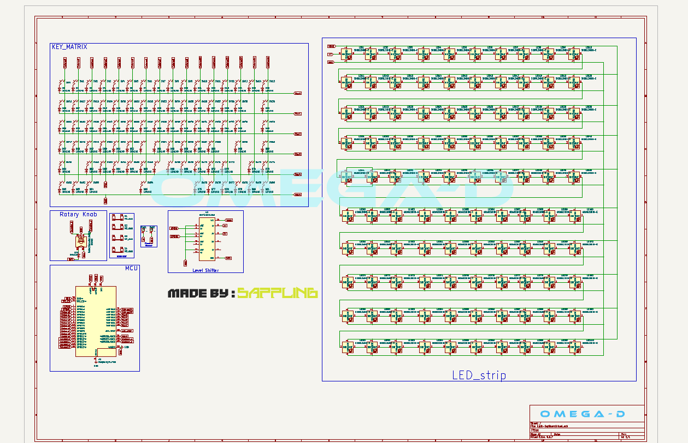
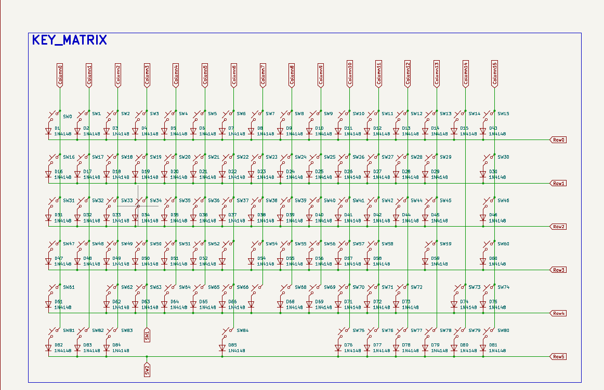
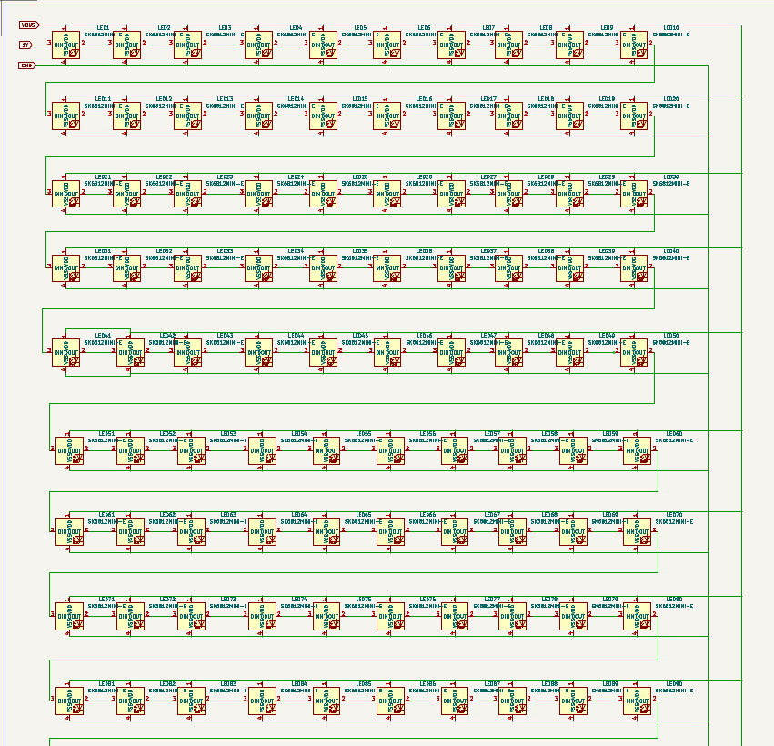
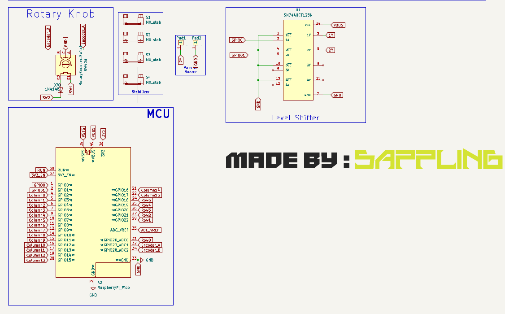
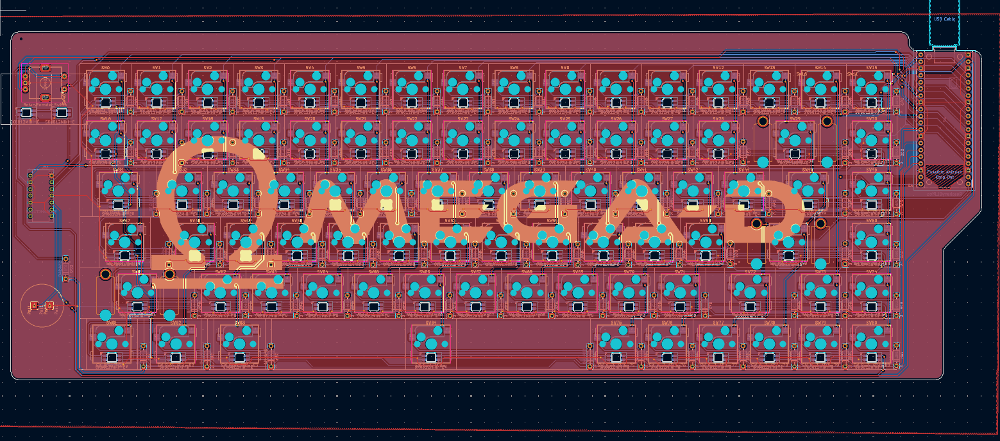
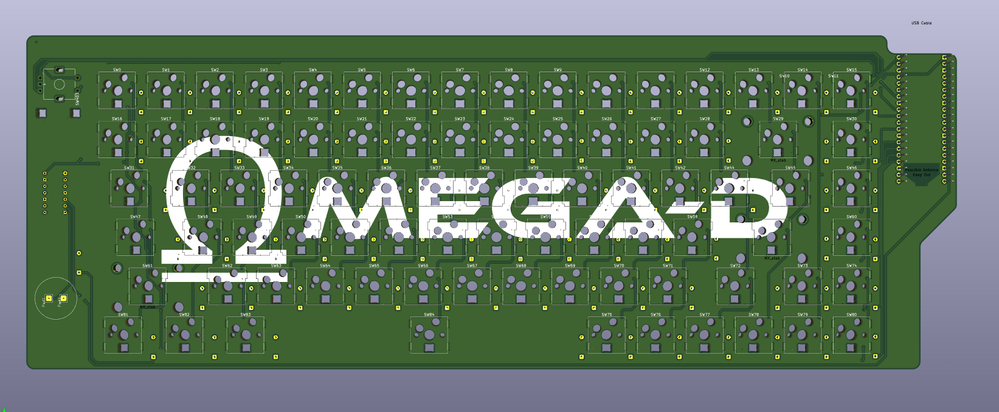
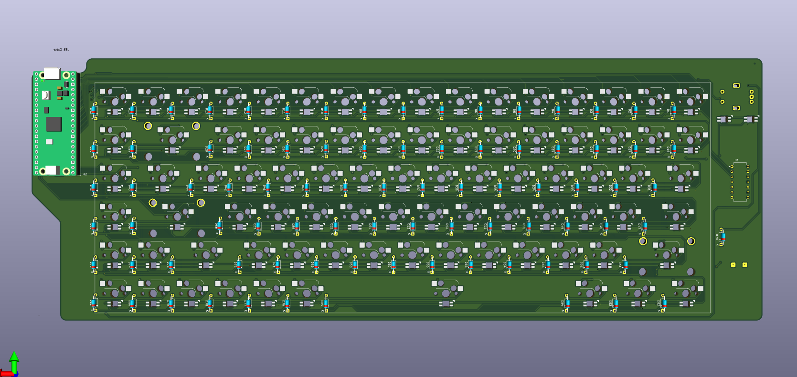

# Omega-D
.png>)

#### Omega-D is fully mechanical and hotswappable 75 % Gasket Mount keyBoard designed by Mohammad Sarfaraz aka Sappling. 

## Features:

* It uses Raspberry pi pico as MCU.
* It is fully mechanical + hotswappable.
* It is Gasket mount for long typing sessons.
* Each key has its own sk6812mini e led. 
* It has a rotary encoder whose switch is connected to switch matrix.
* It has leds around rotary encoder giving a cool look.
* It has multiple modes including normal 84 key and macros layers.
* It has a passive buzzer which gives different notes on different macros.

## Why I made this?

I wanted a mechanical keyboard for my coding for a long time but never got any chance. Hackclub really gave me a great chance to make one. 

## Navigation

* [Firmware](./Firmware/)
* [Production](./Production/)
* [Schematics](#schematics)
* [PCB](#pcb)
* [Cad](#cad)
* [BOM](#bom)
* [License](#licence)

## Schematics

#### Key matix

#### LED Strip

#### MCU and Others

## PCB

## Cad

## BOM

 
| Part | Quantity | Price (INR) | Price (USD) | Link |
|------|----------|-------------|-------------|------|
| Raspberry Pi Pico | 1 | ₹384 | $4.16 | [robu.in](https://robu.in/product/raspberry-pi-pico/) |
| Passive Buzzer | 1 | ₹38 | $0.41 | [robu.in](https://robu.in/product/5v-passive-buzzer-5pcs/) |
| SN74HCT125N | 1 | ₹57 | $0.62 | [robu.in](https://robu.in/product/sn74hct125n-texas-instruments-buffer-74hct125-4-5-v-to-5-5-v-dip-14/) |
| Gateron Milky PRO Switch – 5pin | 9 | ₹1,611 (₹179×9) | $17.44 | [meckeys.com](https://meckeys.com/shop/accessories/keyboard-accessories/key-switches/gateron-mechanical-pro-switch-5pin/?attribute_pa_gateron-key-switches=pro-milky-yellow) |
| Glorious GOAT Stabilizers | 1 | ₹999 | $10.81 | [meckeys.com](https://meckeys.com/shop/accessories/keyboard-accessories/more/glorious-goat-stabilizers/) |
| Cloud Lake Cherry Doubleshot PBT Keycaps | 1 | ₹1,299 | $14.06 | [curiositycaps.in](https://curiositycaps.in/products/cloud-lake-cherry-doubleshot-pbt-keycaps?variant=50852970955033) |
| SK6812MINI-E | 90 | ₹620 | $6.71 | [lcsc.com](https://www.lcsc.com/product-detail/C5149201.html) |
| Hotswap Socket | 90 | ₹351 | $3.80 | [lcsc.com](https://www.lcsc.com/product-detail/C49352235.html?s_z=n_CPG151101S11) |
| 1N4148 Diode | 100 | ₹86 | $0.93 | [lcsc.com](https://www.lcsc.com/product-detail/C402212.html) |
| PCB | 1 | ₹3,917 | $42.43 | — |
| Shipping (meckeys.com) | — | ₹100 | $1.08 | — |
| Shipping (robu.in) | — | ₹49 | $0.53 | — |
| **Total** | | **₹9,511** | **$102.98** | |

## Licence

Creative Commons Attribution-NonCommercial 4.0 International (CC BY-NC 4.0)

---

You are free to:

- **Share** — copy and redistribute the material in any medium or format
- **Adapt** — remix, transform, and build upon the material

The licensor cannot revoke these freedoms as long as you follow the license terms.

---

Under the following terms:

- **Attribution** — You must give appropriate credit, provide a link to the license, and indicate if changes were made.
- **NonCommercial** — You may not use the material for commercial purposes.
- **No additional restrictions** — You may not apply legal terms or technological measures that legally restrict others from doing anything the license permits.

---

No warranties are given. For more details, see the [full license](https://creativecommons.org/licenses/by-nc/4.0/).

## Commercial Use

If you want to use this for Commercial purpose then [Let's chat](#lets-chat).
